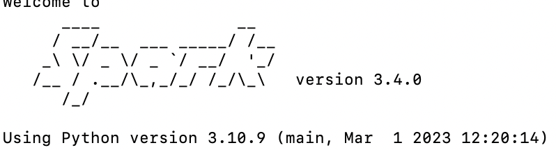

# 환경설정

## Spark 실습환경
- 파이썬
- 주피터 노트북
- 자바
- 스파크
- Pyspark


----
## MAC
1. 파이썬 설치

    - 아나콘다 설치
        - bash에서 "which python3" 실행 시 user/bin/python3(시스템 파이썬) 경로가 아니라 .../opt/anaconda3/bin/python(아나콘다 파이썬)이어야 함 <br/>
        $\rightarrow$ 아나콘다 용량이 커서 일반 파이썬만 사용하려 했지만 안됨! 아나콘다 파이썬으로 해야함

    ```bash
    python3 # activate python
    exit() # 나가기
    which python3 # 시스템 파이썬
    ```

2. 자바 설치
    - 터미널 설치전 [brew](https://brew.sh) 설치 후 java 설치
    - mac M1 brew: [블로그](https://m.blog.naver.com/tnsqo1126/222627852760) 참조

    ``` bash
    # brew(brew 페이지 참조)
    /bin/bash -c "$(curl -fsSL https://raw.githubusercontent.com/Homebrew/install/HEAD/install.sh)"

    # brew mac M1
    eval $(/opt/homebrew/bin/brew shellenv)

    /bin/bash -c "$(curl -fsSL https://gist.githubusercontent.com/nrubin29/bea5aa83e8dfa91370fe83b62dad6dfa/raw/48f48f7fef21abb308e129a80b3214c2538fc611/homebrew_m1.sh)"

    #java 설치
    brew install --cask adoptopenjdk8
    ```

    - 위 과정을 시행했음에도 설치 오류 남 - [해결](https://velog.io/@dlalscjf94/MacOS-JDK-1.8-설치with-brew)

3. 스칼라 설치

    ``` bash
    brew install scala
    ```

4. 스파크 설치
    ``` bash
    brew install apache-spark 
    ```

5. pyspark
    ``` bash
    # 아나콘다 경로의 pip 사용하는지 체크
    pip --version

    pip install pyspark
    ```

    - 설치확인
        ```bash
        pyspark 
        exit() # 나가기  
        ```

        - 포트를 못찾는다는 에러가 발생했다. 
        ``` bah
        WARN Utils: Service 'sparkDriver' could not bind on a random free port. You may check whether configuring an appropriate binding address.
        ```
        - 로컬 IP를 설정해 해결함
        ```
        pyspark -c spark.driver.bindAddress=127.0.0.1
        ```
        - 설치 완료!
        <center></center>
    