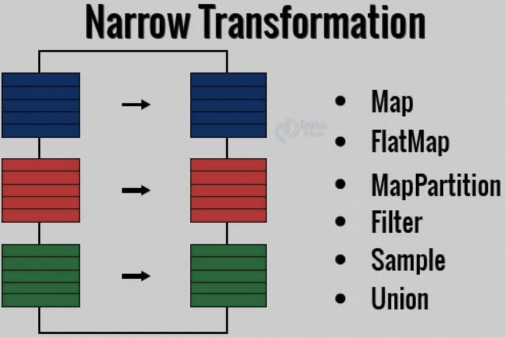
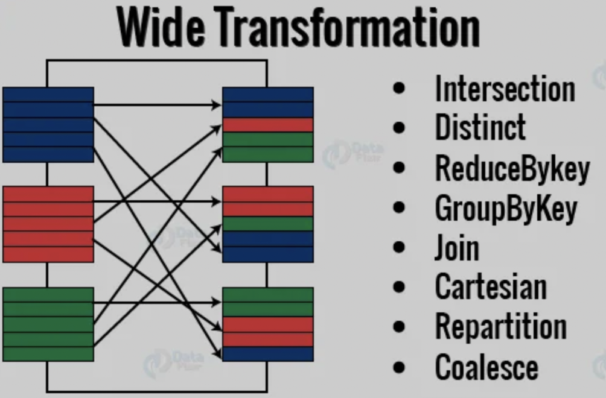
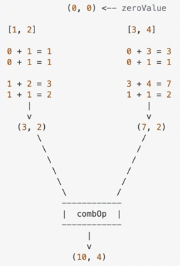

# 분산, 병렬처리의 reduction


## 앞 내용 요약
- transformation: 
    - 정의
        - 기존 RDD가 있을 때 새 RDD를 생성하는 함수
        - RDD lineage(RDD operator graph, RDD dependency graph): 논리적인 실행 계획 DAG
    - 특징
        - 지연실행 $\rightarrow$ 성능 최적화
    - 분류
        <table>
         <tr>
            <td><center></center></td>
            <td><center></center></td>
        </tr>
        </table>
        - Narrow Transformation: 연산하는 데에 파티션들 중 제한된 부분집합만 필요
        - Wide Transformation: 연산하는 데에 다양한 파티션 필요
- action: 
    - 데이터를 실제로 작업
    - action 후 RDD는 nonRDD로 바뀜
    - ex. count(), collect(), take(), save(), show()
- cache & persist: RDD 재사용을 통한 메모리 최적화
    - cache: in-memory 방식(memory only)
    - persist: 다양한 스토리지 레벨 지정 가능
    
-----
## Reduction
- 정의: 근접 요소를 모아서 하나의 결과로 만들기
- 병렬처리가 가능한 경우: 두 개의 요소를 모아 하나로 합칠 수 있음, 각 파티션마다 독립
- 병렬처리가 불가능한 경우: 한 파티션이 다른 파티션 결과에 의존하면 동시 실행 불가, 순서대로 처리할 거면 분산처리 하는 의미 없고 네트워크 시간 때문에 더 느려짐

## Reduction Actions
1. Reduce
    - 사용자가 지정하는 함수를 받아 하나의 값으로 줄임
        ~~~python
        from operation import add
        sc.parallerize([1,2,3,4,5]).reduce(add)
        > 15
        ~~~
    - 주의! 파티션마다 결과가 달라짐
        ~~~python
        sc.parallerize([1,2,3,4], 1).reduce(labmda x,y: (x*2)+y)a
        > 26
        sc.parallerize([1,2,3,4], 3).reduce(labmda x,y: (x*2)+y)
        # 파티션: (1,2), (3,4)
        # ((1*2+2)*2+(3*2+4))=18
        > 18
        ~~~
    - 파티션이 어떻게 나뉠지 정확히 알 수 없음, 연산 순서 상관없이 결과값 보장하려면 다음 법칙 고려해 코딩
        - 교환법칙: a*b=b*a
        - 결합법칙: (a*b)*c = a*(b*c)
2. Fold
    - reduce와 유사하나 zeroValue(시작값)가 들어감
        ~~~python
        from operation import add
        sc.parallerize([1,2,3,4,5]).fold(0,add)  
        > 15
        ~~~
    - reduce vs fold
        ~~~python
        rdd=sc.parallelize([2,3,4],4)
        # case1
        rdd.reduce(lambda x,y: x*y) # (2*3*4)=24
        rdd.fold(1, lambda x,y: x*y) # (1*2*3*4)=24

        # case2
        rdd.reduce(lambda x,y: x+y) # 0+2+3+4=9
        rdd.fold(1, lambda x,y: x+y) # (1+1)+(1+2)+(1+3)+(1+4)=14
        ~~~
3. GroupBy
    - 기준함수를 기준으로 그룹핑해 reduction
        ~~~python
        rdd=sc.parallelize([1,1,2,3,5,8])
        result = rdd.groupBy(lambda x:x%2).collect()
        sorted([(x,sorted(y)) for (x,y) in result])
        > [(0,[2,8]), (1,[1,1,3,5])]
        ~~~
4. Aggregate
    - RDD 데이터 타입과 action 타입이 다를 경우 사용
    - 파티션 단위 연산 결과를 합침
    - RDD.aggregate(zeroValue, seqOp, combOp)
        - zeroValue: 각 파티션에서 누적 시작할 값
        - sequence operation: 타입 변경 함수 $\rightarrow$ map
        - combination operation: 합치는 함수 $\rightarrow$ reduce
        ```python
        seqOp = (lambda x,y: (x[0]+y, x[1]+1))
        combOp = (lambda x,y:(x[0]+y[0],x[1]+y[1]))
        sc.paralleize([1,2,3,4]).aggregate((0,0), seqOp, combOp)
        > (10,4)
        sc.paralleize().aggregate((0,0), seqOp, combOp)
        > (0,0)
        ```
        <center></center>

    