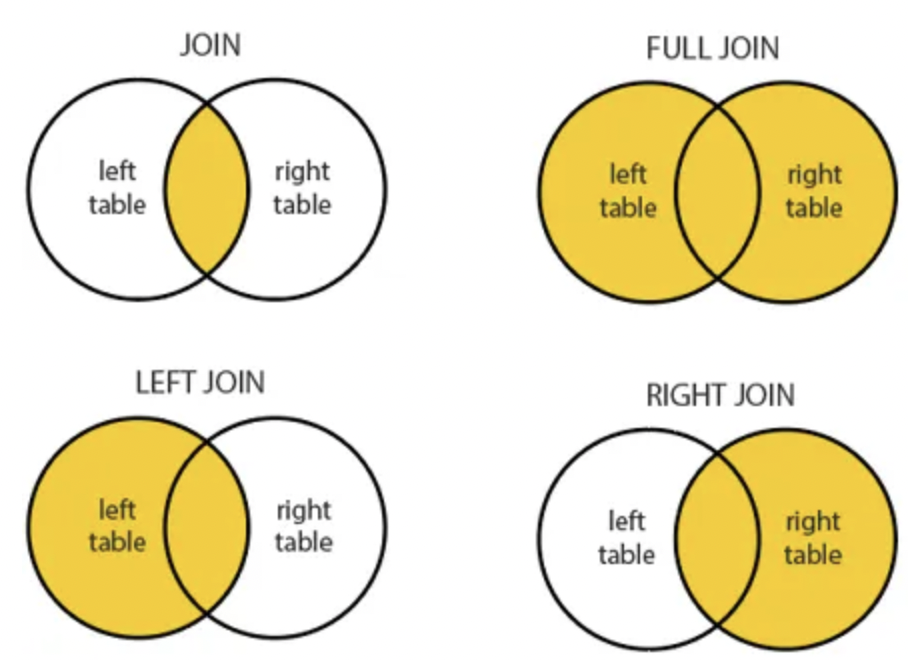

# Key Value RDD

## 1. 정의
    - key value 쌍(pair) 데이터 타입을 다루는 RDD
    - key를 중심으로 action 실행하거나 네트워크를 관통해 재그룹핑함
## 2. 적용가능함수
- [참고 O'REILLY Book](https://www.oreilly.com/library/view/learning-spark/9781449359034/ch04.html)
###  2.1. Transformation
- groupByKey
    ```python
    # groupBy와 달리 groupByKey의 input에는 key 존재
    # groupBy
    rdd = sc.parallelize([1,1,2,3,5,8])
    result = rdd.groupBy(lambda x:x%2).collect()
    sorted([(x,sorted(y)) for (x,y) in result])
    > [(0,[2,8]), (1,[1,1,3,5])]

    # groupByKey
    rdd = sc.parallelize([("a",1), ("b",1) ("a",1)])
    sorted(rdd.groupByKey().mapValues(len).collect())
    > [('a',2), ('b',1)]
    sorted(rdd.groupByKey().mapValues(list).collect())    
    > [('a',[1,1]), ('b',[1])]      
    ```
    - groupBy: 함수를 기준으로 group
    - groupByKey: key를 기준으로 group
- reduceByKey
    ```python
    # reduce
    sc.parallelize([1,2,3,4,5]).reduce(add)
    > 15

    # reduceByKey
    rdd = sc.parallelize([("a",1), ("b",1) ("a",1)])
    sorted(rdd.reduceByKey(add).collect())
    > [('a',2), ('b',1)]
    ```
    - reduce: action(실행됨, 더이상 RDD 아님), 함수를 기준으로 요소 합침
    - reduceByKey: transformation(새 RDD 만듦), key를 기준으로 그룹을 만들고 합침
    - groupByKey + Reduction 개념으로 groupByKey보다 개념이 추가된 것 같아 오래걸릴 것 같지만, **groupByKey보다 reduceByKey가 더 빠르다!** <br/> $\rightarrow$ shuffling & partitioning으로 이유 설명
- mapValues
    - 함수를 value에만 적용, 파티션과 키는 그대로 둠
    ```python
    rdd = sc.parallelize([("a",["apple","banana","lemon"]), ("b", ["grapes"])])
    def f(x):
        return len(x)
    rdd.mapValues(f).collect()
    (['a',3],['b',1])
    ```
- keys
    - 모든 key를 가진 RDD 
    ```python
    # 예제1. key 값 부르기
    x = sc.parallelize([(1,2),[3,4]]).keys()
    x.collect()
    > [1,3]

    # 예제2. unique key 개수 세기
    x = sc.parallelize([('math',3), ('english',2), ('math',5), ('science',1),('math',2)])
    x.distinct().count()
    > 3 
    ```
- join(leftOuterJoin, rightOuterJoin)
    - 여러개의 RDD를 합침
    - 방식
        - Inner Join
        - Outer Join
            - LeftOuterJoin: 왼쪽 데이터를 모두 출력, **반대편 데이터가 없는 경우 None**
            - RightOuterJoin
                <center></center>
        ```python
        rdd1 = sc.parallelize([('foo',1), ('bar',1), ('baz',3)])
        rdd3 = sc.parallelize([('foo',4), ('bar',5), ('bar',6), ('zoo',1)])

        rdd1.join(rdd2).collect() # 교집합 key인 foo, bar만
        > [('bar', (2,5)), ('bar', (2,6)), ('foo', (1,4))]

        rdd1.leftOuterJoin(rdd2).collect() # rdd1 키 중심
        # baz가 rdd2 key에 없으므로 value가 None
        > [('baz', (3, None)), ('bar', (2,5)), ('bar', (2,6)), ('foo', (1,4))]

        rdd1.rightOuterJoin(rdd2).collect() # rdd2 키 중심
        # zoo가 rdd2 key에 없으므로 value가 None
        > [('bar', (2,5)), ('bar', (2,6)), ('zoo',(None,1)), ('foo', (1,4))]
        ```
### 3.2. Actions
- countByKey
    - 각 키가 가진 요소를 셈
    ```python
    rdd = sc.parallelize(("a",1), ("b",1) ("a",1))
    sorted(rdd.countByKey().items())
    > [('a',2), ('b',1)]
    ```