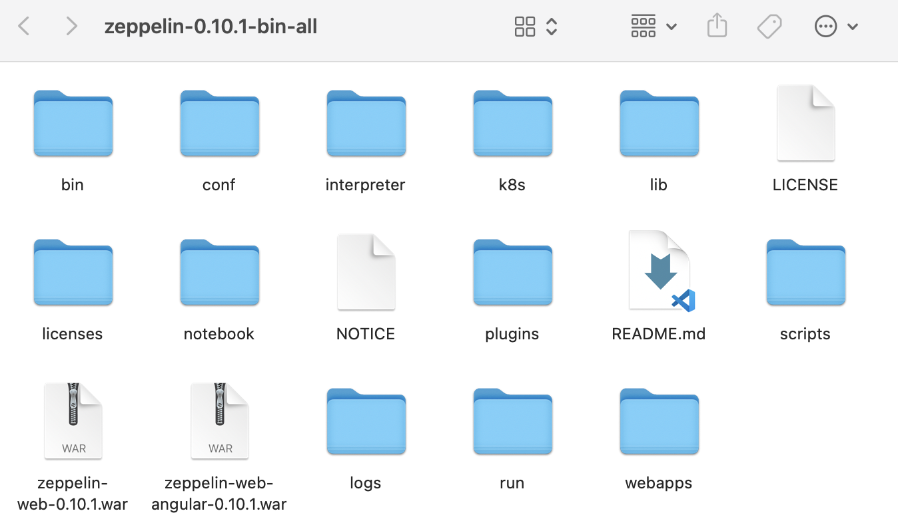
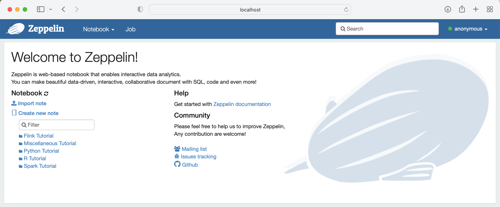
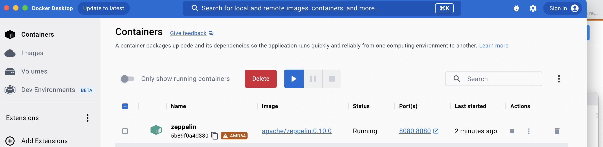
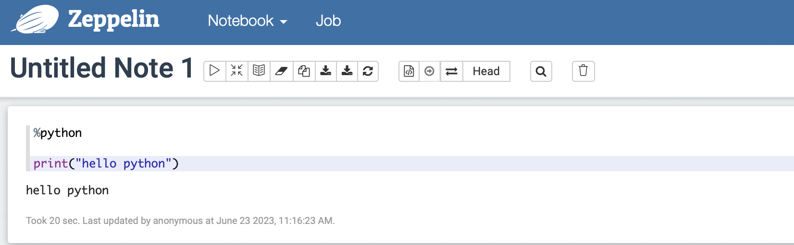

# Zeppelin

# I. 설치
1. 로컬 환경
    - 참고 출처
        - [설치 참고 블로그](https://swalloow.github.io/)
        - [설치 및 실행 참고 블로그](https://zzsza.github.io/data/2018/06/02/apache-zeppelin/)
        - [공식문서](https://zeppelin.apache.org/docs/0.8.0/quickstart/install.html)
    - homebrew 또는 홈페이지에서 아파치 제플린 설치
    - 설치 경로 아래에 bin/zeppelin-daemon.sh 존재
        <center></center>
    - bsah: 설치 경로를 cd로 지정 후 다음 실행
        ```bash
        ./bin/zeppelin-daemon.sh start
        ```
    - 터미널 실행한 채로(위 명령어 유지한 채로) 로컬 호스트 접속(safari에 localhost:8080 경로 입력)
        <center></center>
    - 사용 완료 후 제플린 종료
        ```bash 
        ./bin/zeppelin-daemon.sh stop
        ```

# 2. 도커로 제플린 설치
- [설치 참고](https://moons08.github.io/programming/zeppelin-with-docker/)
- 도커 이미지 받고 로컬 호스트 지정해서 실행해보기
    ```bash
    docker pull apache/zeppelin:0.10.0

    docker run -d --rm \
    -p 8080:8080 \
    -v $PWD/logs:/logs \
    -v $PWD/data:/data \
    -v $PWD/notebook:/notebook \
    -e ZEPPELIN_ADDR='0.0.0.0' \
    -e ZEPPELIN_NOTEBOOK_DIR='/notebook' \
    -e ZEPPELIN_LOG_DIR='/logs' \
    --name zeppelin apache/zeppelin:0.10.0
    ```
    <center></center>
    
    - port 클릭해서 실행 후 확인
    <center></center>
    