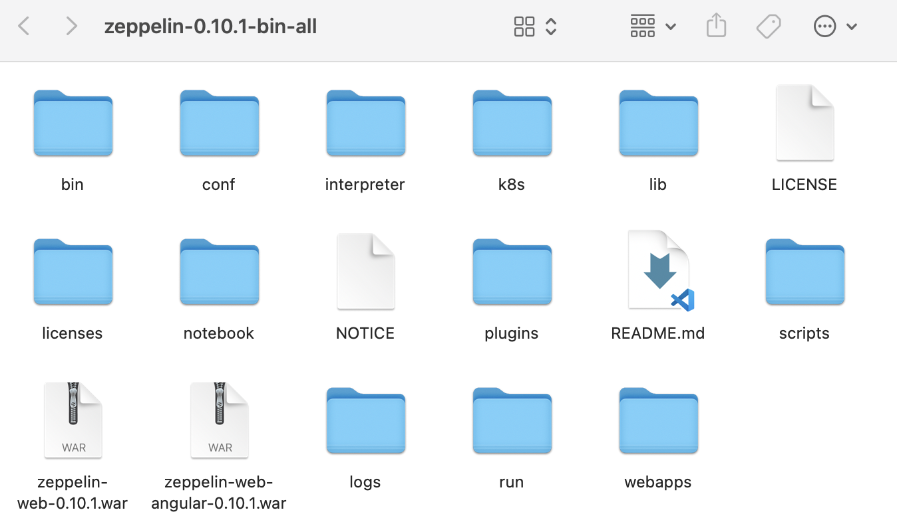
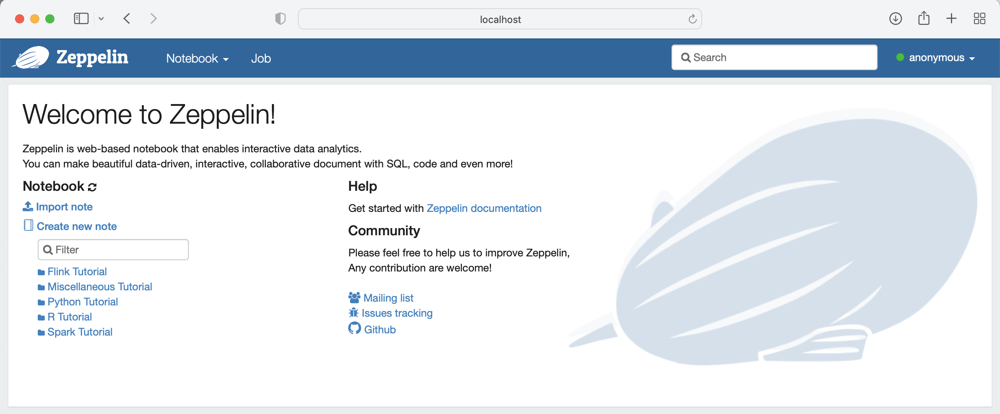

# Zepplin


# I. 설치
1. 로컬 환경
    - 참고 출처
        - [설치 참고 블로그](https://swalloow.github.io/)
        - [설치 및 실행 참고 블로그](https://zzsza.github.io/data/2018/06/02/apache-zeppelin/)
        - [공식문서](https://zeppelin.apache.org/docs/0.8.0/quickstart/install.html)
    - homebrew 또는 홈페이지에서 아파치 제플린 설치
    - 설치 경로 아래에 bin/zeppelin-daemon.sh 존재
        <center></center>
    - bsah: 설치 경로를 cd로 지정 후 다음 실행
        ```bash
        ./bin/zeppelin-daemon.sh start
        ```
    - 터미널 실행한 채로(위 명령어 유지한 채로) 로컬 호스트 접속(safari에 localhost:8080 경로 입력)
        <center></center>

        