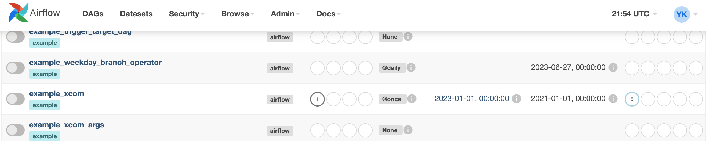

# Airflow CLI

- 에어플로우에서 자주 사용하는 커맨드라인을 알아보자!

- 에어플로우에서는 다음과 같은 커맨드 사용 가능

    ```bash
    > airflow -h

    # 다양한 커맨드들
    Usage: airflow [-h] GROUP_OR_COMMAND ...

    Positional Arguments:
    GROUP_OR_COMMAND
        
        Groups: # 번들 사용
        celery         Celery components
        config         View configuration
        connections    Manage connections
        dags           Manage DAGs # 대그 관리
        db             Database operations # 디비 관리
        jobs           Manage jobs
        kubernetes     Tools to help run the KubernetesExecutor
        pools          Manage pools
        providers      Display providers
        roles          Manage roles
        tasks          Manage tasks
        users          Manage users
        variables      Manage variables
        
        Commands: # 일회성 사용
        cheat-sheet    Display cheat sheet 
        dag-processor  Start a standalone Dag Processor instance
        info           Show information about current Airflow and environment # 현 환경정보
        kerberos       Start a kerberos ticket renewer
        plugins        Dump information about loaded plugins
        rotate-fernet-key
                        Rotate encrypted connection credentials and variables
        scheduler      Start a scheduler instance
        standalone     Run an all-in-one copy of Airflow
        sync-perm      Update permissions for existing roles and optionally DAGs
        triggerer      Start a triggerer instance
        version        Show the version
        webserver      Start a Airflow webserver instance # 웹서버 시작

    ```

    # 1. user 생성

    - user 생성(로그인 아이디, 비밀번호 지정)
        ``` bash
        > airflow users create --role Admin --username admin --email admin --firstname admin --lastname admin --password admin
        ```
    - 두 번째 유저를 생성하려면
        ``` bash
        > airflow users create -r Admin -u admin2 -e admin2@gmail.com -f yuri -l kim -p admin2
        ```
    - airflow users list로 현재까지 생성된 유저 확인
        <center></center>
    - 참고. airflow users 명령어로 사용할 수 있는 기능
        ```bash
        > airflow users -h

        Usage: airflow users [-h] COMMAND ...

        Manage users

        Positional Arguments:
        COMMAND
            add-role   Add role to a user
            create     Create a user
            delete     Delete a user
            export     Export all users
            import     Import users
            list       List users
            remove-role
                    Remove role from a user

        Optional Arguments:
        -h, --help   show this help message and exit
        ```


# 2. airflow 페이지 열기

- bash
    ```bash
    airflow webserver
    ```
    - 터미널에 다음과 같은 내용이 뜨면 localhost 접속을 진행
        <center></center>

- web
    ```bash
    localhost:8080
    localhost:8080/home # 내 경우는 이미 제플린이 localhost:8080 사용중이어서 /home을 붙여야 airflow가 떴다. 
    ```
    
    - 위에서 설정한 username과 password인 admin으로 접속한다.
        <center></center>

    - 접속하면 다음과 같은 워크플로우 화면이 나온다.
        <center></center>


- 참고: 포트 충돌
    - 포트가 완전히 안닫히면 'The webserver is already running under PID 2221.'와 같은 에러가 남
        ```
        # 완전히 안닫힌 pid 종료
        kill -9 $(lsof -t -i:8080)
        ```

# 3. 스케줄러 만들기

- 아직 스케줄러를 안 만들었기 때문에 페이지 상단에 "The scheduler does not appear to be running.
The DAGs list may not update, and new tasks will not be scheduled." 와 같은 오류가 뜬다.
- 스케줄러 만들기
    - 터미널을 하나 더 켜서 다음을 실행하고 airflow 웹페이지를 새로고침하면 에러가 사라진다.
        ```bash
        airflow scheduler
        ```

# 4. DB

- airflow db -h
    ```bash
    Usage: airflow db [-h] COMMAND ...

    Database operations

    Positional Arguments:
    COMMAND
        check           Check if the database can be reached 
        check-migrations
                        Check if migration have finished
        clean           Purge old records in metastore tables
        downgrade       Downgrade the schema of the metadata database.
        drop-archived   Drop archived tables created through the db clean command
        export-archived
                        Export archived data from the archive tables
        init            Initialize the metadata database # 데이터베이스에 기본적인 파이프라인(예제) 생성됨 
        reset           Burn down and rebuild the metadata database # db 초기화됨 
        shell           Runs a shell to access the database
        upgrade         Upgrade the metadata database to latest version # airflow 버전 업그레이드

    Optional Arguments:
    -h, --help        show this help message and exit
    ```

# 5. Dags

- airflow dags -h
    ```bash
    Usage: airflow dags [-h] COMMAND ...

    Manage DAGs

    Positional Arguments:
    COMMAND
        backfill          Run subsections of a DAG for a specified date range # 문제 해결 후 데이터를 되돌림
        delete            Delete all DB records related to the specified DAG # 데이터 베이스 내 대그 없애기
        details           Get DAG details given a DAG id
        list              List all the DAGs # 현재 존재하는 대그 리스트
        list-import-errors
                        List all the DAGs that have import errors
        list-jobs         List the jobs # 현재 존재하는 잡 리스트
        list-runs         List DAG runs given a DAG id
        next-execution    Get the next execution datetimes of a DAG
        pause             Pause a DAG
        report            Show DagBag loading report
        reserialize       Reserialize all DAGs by parsing the DagBag files
        show              Displays DAG's tasks with their dependencies
        show-dependencies
                        Displays DAGs with their dependencies
        state             Get the status of a dag run
        test              Execute one single DagRun
        trigger           Trigger a DAG run
        unpause           Resume a paused DAG

    Optional Arguments:
    -h, --help          show this help message and exit
    ```

- 대그 리스트 조회
    ```
    > airflow dags list

    dag_id                        | filepath                      | owner   | paused
    ==============================+===============================+=========+=======
    dataset_consumes_1            | /Users/kim/anaconda3/envs | airflow | True  
                                | /py_3_8/lib/python3.8/site-pa |         |       
                                | ckages/airflow/example_dags/e |         |       
                                | xample_datasets.py            |         |       
    dataset_consumes_1_and_2      | /Users/kim/anaconda3/envs | airflow | True  
                                | /py_3_8/lib/python3.8/site-pa |         |       
                                | ckages/airflow/example_dags/e |         |       
                                | xample_datasets.py            |         |       
    dataset_consumes_1_never_sche | /Users/kim/anaconda3/envs | airflow | True  

    ```

- 특정 대그 내 태스크 확인
    <center></center>

    ```
    > airflow tasks list example_xcom

    bash_pull
    bash_push
    pull_value_from_bash_push
    puller
    push
    push_by_returning
    ```

- 트리거 확인
    ```bash
    > airflow dags trigger -h

    Usage: airflow dags trigger [-h] [-c CONF] [-e EXEC_DATE] [--no-replace-microseconds] [-o table, json, yaml, plain] [-r RUN_ID] [-S SUBDIR]
                                [-v]
                                dag_id

    Trigger a DAG run

    Positional Arguments:
    dag_id                The id of the dag

    Optional Arguments:
    -h, --help            show this help message and exit
    -c, --conf CONF       JSON string that gets pickled into the DagRun's conf attribute
    -e, --exec-date EXEC_DATE
                            The execution date of the DAG # 대그가 실행되는 날짜
    --no-replace-microseconds
                            whether microseconds should be zeroed
    -o, --output (table, json, yaml, plain)
                            Output format. Allowed values: json, yaml, plain, table (default: table)
    -r, --run-id RUN_ID   Helps to identify this run
    -S, --subdir SUBDIR   File location or directory from which to look for the dag. Defaults to '[AIRFLOW_HOME]/dags' where [AIRFLOW_HOME] is the value you set for 'AIRFLOW_HOME' config you set in 'airflow.cfg'
    -v, --verbose         Make logging output more verbose
    ```

    - 트리거 추가
        ```
        airflow dags trigger -e 2023-01-01 example_xcom
        ```

        <center></center>

        - 실행예정이기 때문에 회색(queued) 상태로 트리거 추가됨
        
            <center></center>
            <center></center>