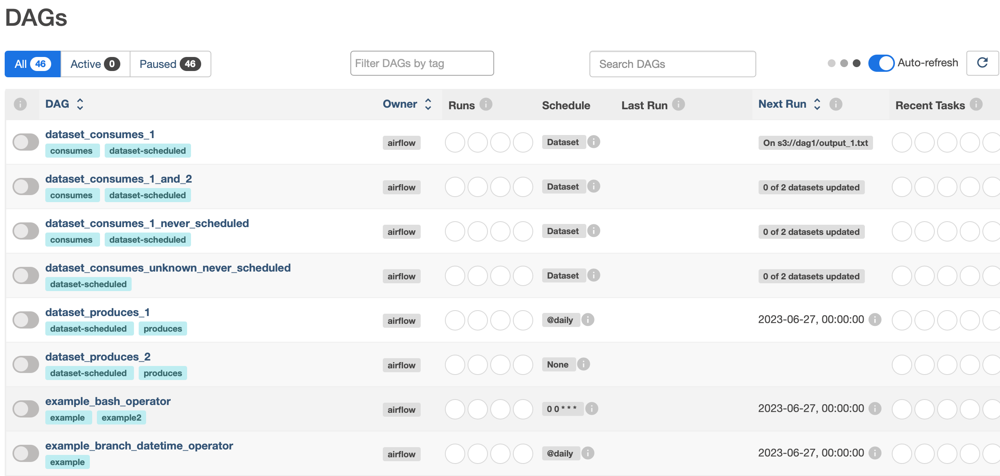
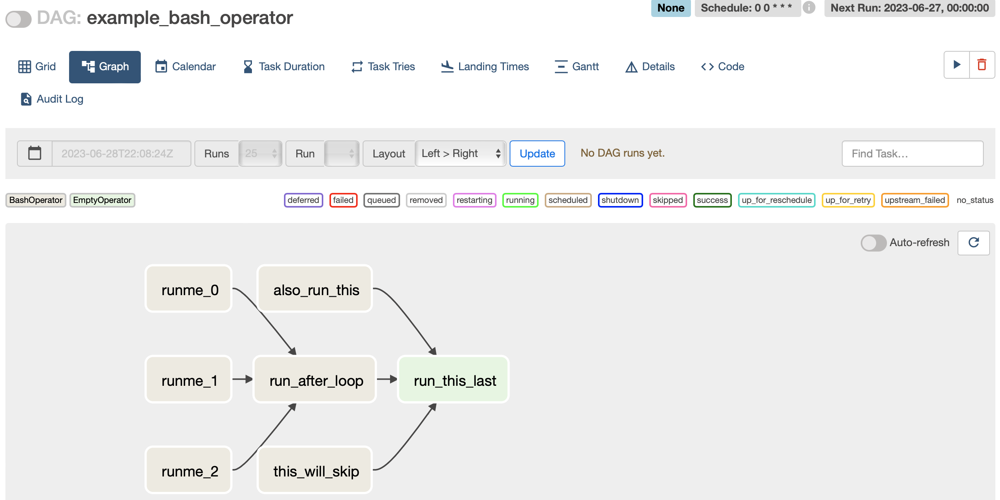
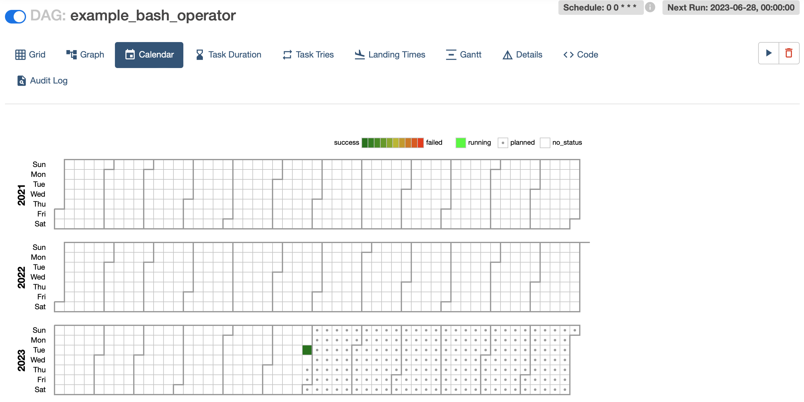
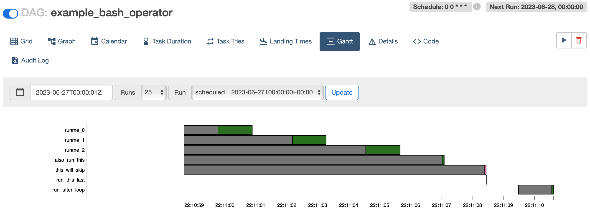
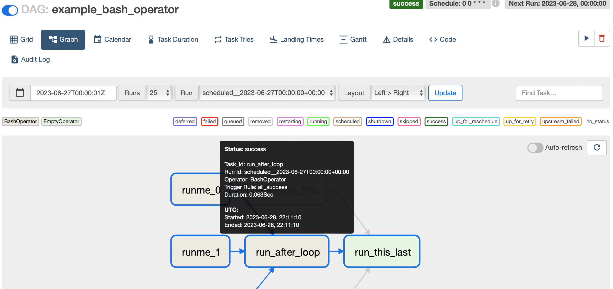
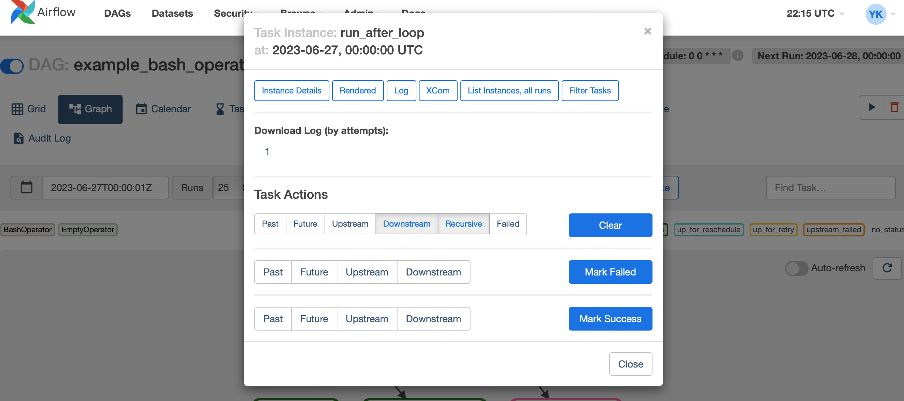

# Airflow UI

- 에어플로우 화면 내 기능 설명

- 실행 상태 전체
    

    - 가장 왼쪽: Puase/Unpuase Dag, 코드 켜고 끄기
    - Runs: 지금까지 실행된 job의 실행상태 개수, queued, sucess, running, failed
    - schedules: 파이프라인 주기 배치(cron tab)
        - [크론 표현식 만들어보기](https://crontab.guru): 배치 실행 주기를 크론 형식으로 나타냄
            - ex. at 04:05 $\rightarrow$ 5 4 * * * (minute, hour, day, month, day)

- Graph
    - 태스크 간 의존성 확인
         - run_after_loop는 runme0, runme1, runme2에 의존, 세 태스크가 끝나야 run_after_loop 실행
            

    - Calender
        - 일 별 태스크 성공 여부 확인
            

    - Gantt
        - 태스크 별 실행 시간 확인, 예컨대 runme0과 runme1이 병렬처리돼 있으면 두 태스크 바는 나란히 나열됨
            

    - 태스크 별 확인
        - 태스크 별 내용 확인
            

        - 한 태스크를 수동으로 내용 바꿀 수 있음, 실행 로그도 확인
            

